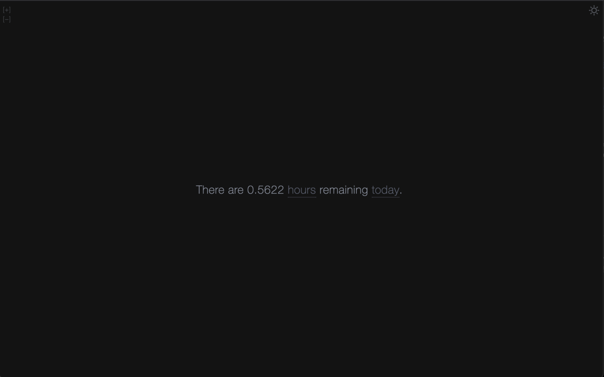
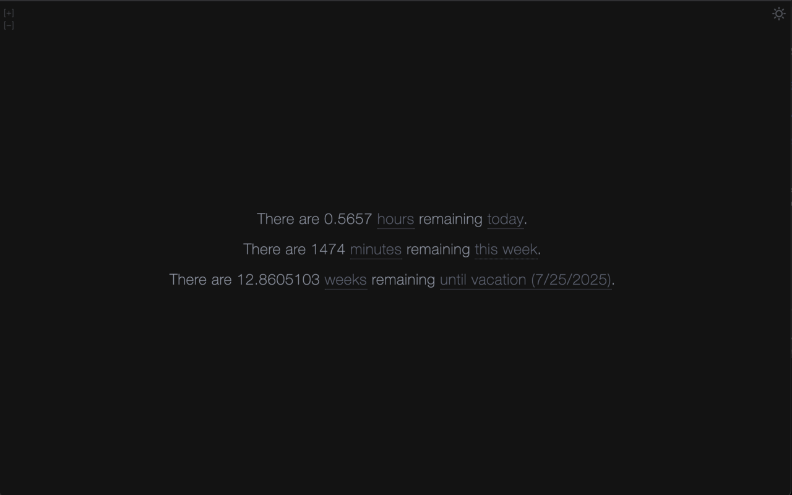
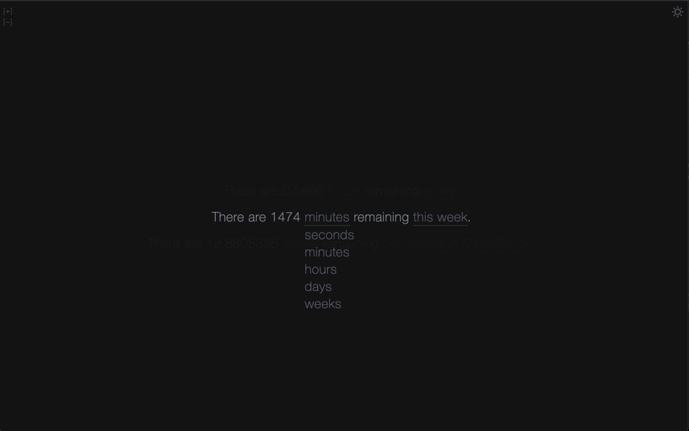
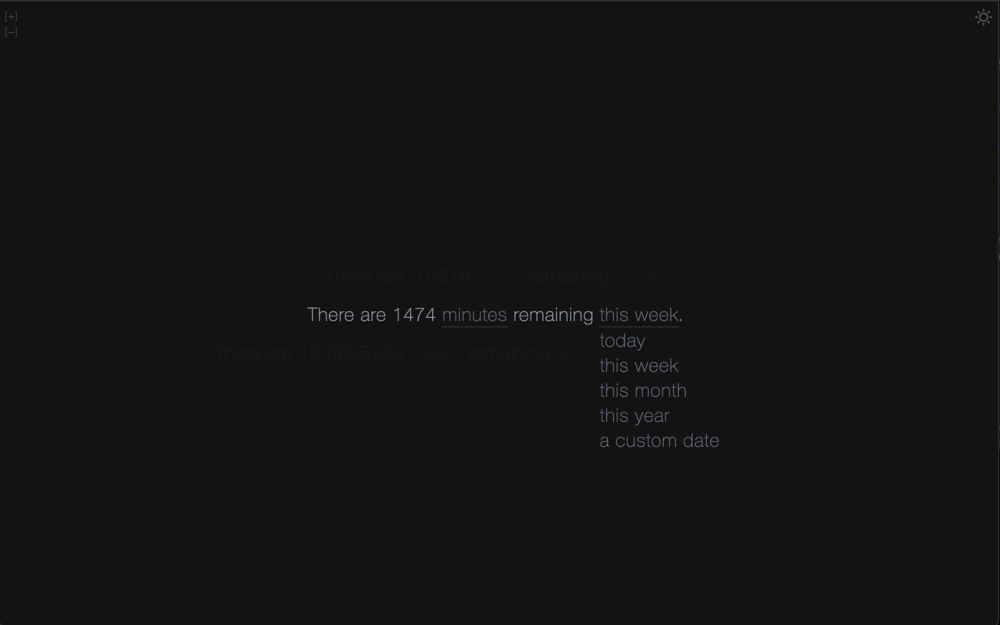
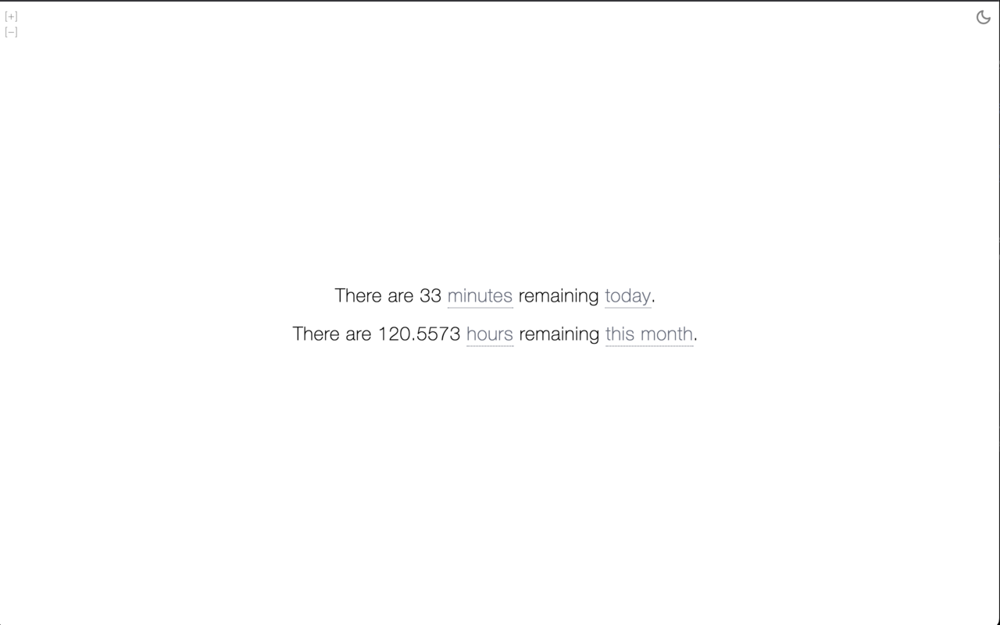

# New Tab Countdown, with dark mode

This is an extension that displays multiple countdowns on your new tab page.
It is forked from [New Tab Countdown](https://github.com/new-tab-countdown/new-tab-countdown) by [Sebastian Liu](https://sebastian-liu.com/), with dark mode, and an increased countdown limit.

## Screenshots







## Developing

```bash
pnpm dev

# or start the server and open the app in a new browser tab
pnpm dev -- --open
```

## Building

To create a production version of your app:

```bash
pnpm build
```
